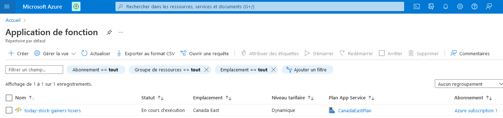
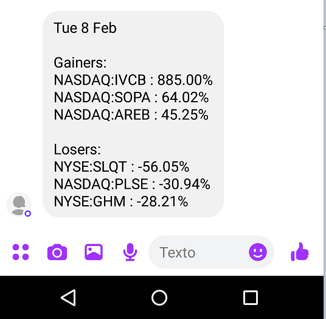

# Azure Serverless Timer Function

Small project to learn the basics of Azure Timer Function.

This function runs each weekday at 4pm (at US market close) and sends a SMS with the top 3 / bottom 3 stocks of the day.

Result:

